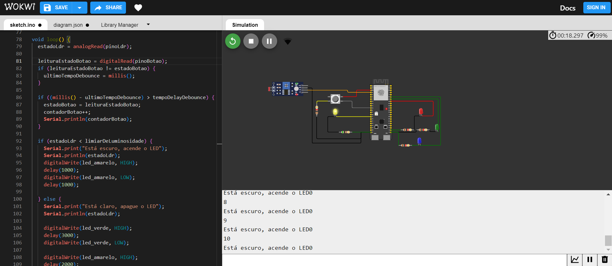
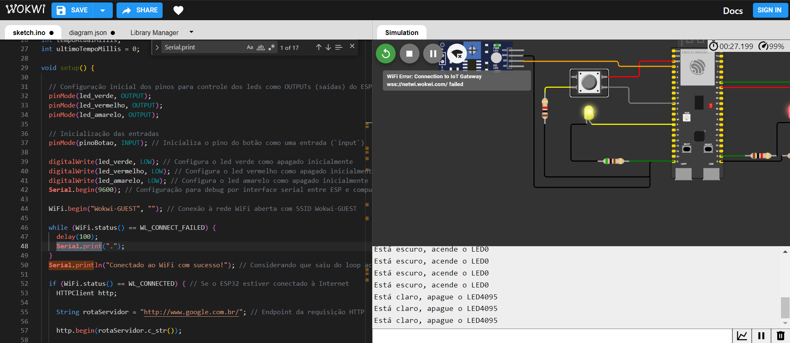

# Prova Prática - M04 - Simulador Wowki
### Aluno: Lucas Matheus Nunes - Turma: 14

O projeto envolve a construção de um protótipo de semáforo inteligente com LEDs.

Segue-se imagens ilustrativas:

Funcionamento do modo noturno

Funcionamento do modo modo claro em verde

Funcionamento do modo modo claro em amarelo

Funcionamento do modo claro em vermelho

Além disso, as funcionalidades de 

Ademais, por problemas de instabilidade de conexão, não foi possível registrar o teste das funcionalidades de envio de requisição HTTP. Nesse sentido, embora eu tenha conseguido testar uma vez o envio da requisição, ao final da prova, quando fui registrar o teste, houve um problema de conexão generalizado com outros alunos da turma 14 também. Desse modo, o erro está presente na figura a seguir:

Indisponibilidade de conexão para envio de requisição HTTP.

Além disso, para validação mais aprofundada, o código do projeto está disponível na pasta (`src`).
